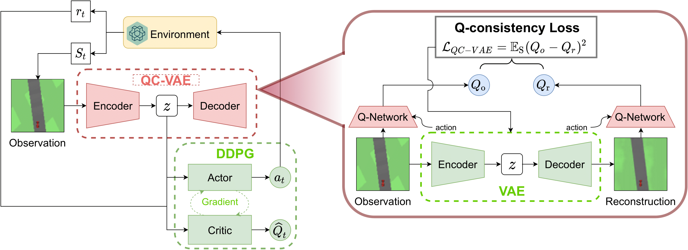

# VAE Facilitates Reinforcement Learning

Final project for Bayesian theory and computation @ PKU (2021 Spring).

## About this Project

This project aims to train an RL agent able to drive in the `CarRacing-v0` [environment](https://gym.openai.com/envs/CarRacing-v0/) using features extracted by Q-Consistency regularized VAE (QC-VAE).

The pipeline of the whole process is illustrated in the figure below



You can find our thesis [here](./assets/Bayesian_Theory_and_Computation___Team_Project.pdf).

## Environment

This project depends on the following python packages:

* pytorch
* cudatoolkit=10.2
* tensorflow=1.15.0
* tqdm
* Pillow
* gym
* pybox2d
* pyvirtualdisplay

, and the following Linux libraries:

* xvfb

For your convenience, you can run the [setup script](./setup.sh) to configure the runtime environment:

```sh
sudo setup.sh
```

## Code Structure

Sub-modules:

* [OpenAI-GYM-CarRacing-DQN](https://github.com/Mzhhh/OpenAI-GYM-CarRacing-DQN): containing an pre-trained expert DQN agent whose action is used when training our Q-network
* [TD3](https://github.com/Mzhhh/TD3.git): forked from [this repo](https://github.com/sfujim/TD3) and modified by *Zihan Mao*, contains components of DDPG (and CNN-DDPG)

In this repo:

* `VAE.py`: implement VAE with convolutional layers
* `train_critic.py`: train Q-network using action performed by expert DQN agent
* `train_vae.py`: train QC-VAE with usual VAE loss and our Q-consistency loss computed by the pre-trained Q-network
* `train_agent.py`: train DDPG agent using features extracted by the QC-VAE
* `baseline.py`: train baseline agent (DDPG with convolutional layers) using the image inputs themselves
* `util.py`: helper functions that help processing image inputs
* `model/`: model folder

## Contact Info

**Code Author**: Zihan Mao -- [Personal Email](zihanmao@outlook.com), [Educational Email](1700011306@pku.edu.cn)

**Project Link**: https://github.com/Mzhhh/VAEFRL


## Acknowledgment 

Thanks to the related repositories on Github and various questions on Stackoverflow, without which I couldn't have written a single line of bug-free code.

